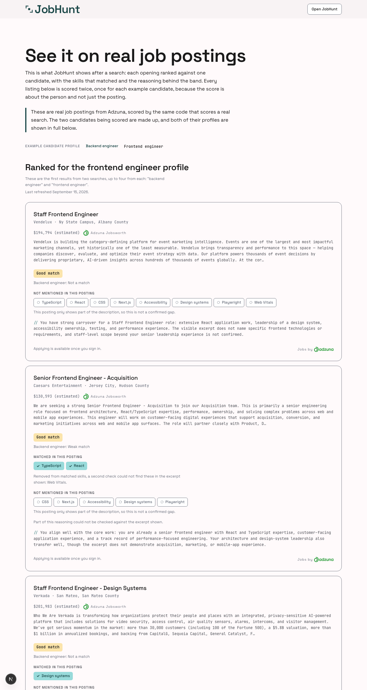
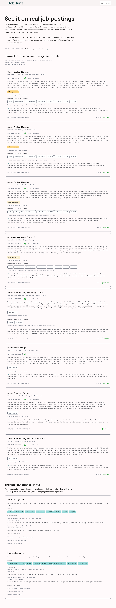
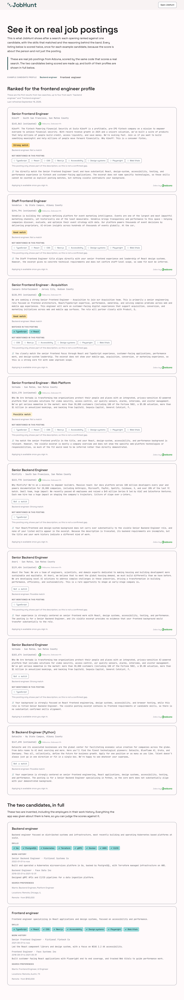

# Experiments: seeded demo account · spec 0021

**This file now covers two runs.** Sections 1 to 3 are the local stack run of
2026-09-15. Section 4 is the first production run, 2026-09-16, added after the
feature merged. The local sections are left exactly as they were written.

Run 2026-09-15 during `/check verify seeded demo account`, immediately after
spec 0021's Build plan step 10 shipped: the one broad `"software engineer"`
search replaced by two opposed searches, `"backend engineer"` and
`"frontend engineer"`, four listings kept from each by an alternating walk.

**What this cost.** 8 Adzuna searches, 35 `ai_scoring` calls and 4 `ai_check`
calls, spread across one good refresh and five deliberate abort runs (a refused
first search, a refused second search, a forced Adzuna failure, a scoring
refusal and a grounding check failure), all against the local stack's own caps. The numbers below are worth reading with
that in mind: this is a paid measurement, not a re runnable check, and
`verify.md` beside the spec is what gets re run.

Environments referred to below:

- **local**: Supabase in Docker, `127.0.0.1:54321`, schema from
  `supabase/migrations/20260913120000_demo_result.sql` as edited on 2026-09-15,
  applied by `pnpm db:reset` and read back from inside the container. The
  application was `pnpm dev` on port 3000 with the real Adzuna, OpenAI
  (`ai_scoring`) and Google (`ai_check`) keys from `.env.local`.
- **production** (section 4 only): `https://usejobhunt.dev` on Vercel, against
  the hosted Supabase project, with the migration applied by the `Database
  migrations` workflow on merge commit `eec3186`. The refresh was triggered by
  `POST /api/demo/refresh` with the real `DEMO_REFRESH_SECRET`.
- **Sentry, local sink**: not the hosted `jobhunt` project. The dev server was
  started with `SENTRY_DSN` pointing at a small local HTTP listener that wrote
  every envelope to disk, so the events quoted below are the SDK's own payloads
  as sent, and nothing reached the real project. There is no Sentry API token in
  this repository, so this was the only way to read an event's contexts and span
  attributes.

---

## 1. What do two opposed searches actually produce, and does the stopping rule fire?

**Why it matters.** The two search revision exists because the first real
refresh, on `"software engineer"`, wrote 16 rows of which 15 carried zero
matched skills. Cards with no matched skills cannot show the skill matching the
page exists to demonstrate. Spec 0021's own Follow up put a stopping rule on the
new queries: if the next refresh still shows mostly empty own role rows, the
cause is Adzuna's 500 character snippet rather than the query, and the two
queries are never changed again. That rule had never been read against a real
run, and the count it reads is not the obvious one: each candidate is also
scored against the other candidate's role postings, where zero matched skills is
usually the correct answer, so up to half the rows are empty by design.

**What was run.** One `POST /api/demo/refresh` with the real shared secret,
against the local stack with real vendor keys, then an independent recomputation
of the same four numbers straight from `demo_result`.

```
curl -s -X POST -H "Authorization: Bearer $DEMO_REFRESH_SECRET" \
  http://localhost:3000/api/demo/refresh

select 'own_rows='   || count(*) filter (where own)
    || ' own_empty='   || count(*) filter (where own and m = 0)
    || ' cross_rows='  || count(*) filter (where not own)
    || ' cross_empty=' || count(*) filter (where not own and m = 0)
from (
  select (persona_slug = 'backend-engineer'  and search_title = 'backend engineer')
      or (persona_slug = 'frontend-engineer' and search_title = 'frontend engineer') as own,
         cardinality(matched_skills) as m
  from public.demo_result
) t;
```

**Result: the refresh landed, and the stopping rule fired.**

```
route 200 body:
{"refreshed":true,"listings":8,"rows":16,
 "ownRoleRows":8,"ownRoleEmpty":6,"crossRoleRows":8,"crossRoleEmpty":8}

SQL recomputation from demo_result:
own_rows=8 own_empty=6 cross_rows=8 cross_empty=8
```

All four numbers the route reported match the four computed independently from
the stored rows. Six of the eight own role rows carry an empty
`matched_skills`, and the rule fires at five, so by spec 0021's own Follow up
**Adzuna's 500 character snippet is the cause of the empty matched skill lists,
and the two queries are not changed again.**

**The counts were proved able to move before being trusted.** A number that
cannot move reads exactly like a number that did not need to. One own role row's
`matched_skills` was emptied on purpose and the same query re run, which took
`own_empty` from 6 to 7; the row was then restored from the run's own dump and
the table's fingerprint (`md5` over every row) matched what it had been before.
Only after that was the 6 treated as a measurement.

```
before: own_empty=6 cross_empty=8
UPDATE 1
after:  own_empty=7 cross_empty=8
```

**What the screenshots show.** Both were captured from the live page before
anything touched the data, so they are the same rows the numbers above describe.

`docs/images/demo-backend-engineer.png`, `/demo?persona=backend-engineer`, the
backend candidate's ranking. Its first card is Mintlify's Senior Backend
Engineer at `Strong match`, and the compact line under the band reads "Frontend
engineer: Not a match", which is the cross candidate comparison AC-16 exists to
show.


`docs/images/demo-frontend-engineer.png`, `/demo?persona=frontend-engineer`, the
same eight listings ranked for the frontend candidate. It carries the only cards
with matched skills in the whole run (TypeScript and React on the Caesars
Entertainment posting), the ungrounded skills sentence ("Removed from matched
skills, a second check could not find these in the excerpt shown: Web Vitals"),
and the reasoning caveat beneath it.



**This is the first hard measurement behind a deferred item.** `docs/scope/scope.md`'s
Deferred list carries **Fetch the full job posting for scoring**, fetching
`job_url`'s full text instead of scoring Adzuna's 500 character excerpt, and
beside it the v2 consideration of **JobsPipe** (`https://jobspipe.dev`), whose
`Job.description` field carries the full posting text in the search response
itself. Until this run both were argued from the shape of the data rather than
from a measurement. The number to quote from here on is **6 of 8 own role rows
with no matched skills at all**, on postings whose titles match the candidate's
own first desired title. That is the information gap those two items are about,
measured on real postings and a real scorer rather than reasoned about.

**Ruled out, and how.**

- **Not the query being too broad any more.** That was the failure of the
  previous run, `"software engineer"`, three of whose eight listings were
  embedded, FPGA or robotics roles neither candidate fits. Every listing in this
  run is a backend or frontend engineering role, and the empty lists persist.
- **Not the scorer refusing to name skills.** It names them when the text
  supports it: three matched skills survived across the sixteen rows, and the
  grounding check removed one more (`Web Vitals`) as not present in the excerpt,
  which is the check working rather than failing.
- **Not a counting mistake about which rows to read.** Counting empties across
  all 16 rows would give 14, which would have fired the rule on almost any run
  and for the wrong reason, since cross role emptiness is expected. The own role
  pair is the half that answers the question, and it was recomputed
  independently of the route.

## 2. Does a refused second search abort cleanly, and does the report say which search?

**Why it matters.** Two searches per refresh mean the budget can allow the first
and refuse the second, a state the one search version could not reach. A refusal
must abort the whole refresh with nothing written, must not spend a model call,
and must say which of the two searches was declined, otherwise an operator
reading the report cannot tell a first search refusal from a second one.

**What was run.** The `job_search` global day cap was read for an explicit UTC
date, then set to that day's `consumed_count` plus one, so the backend search
would be allowed and the frontend search refused.

```
update public.usage_cap set cap_value = 1
 where call_type = 'job_search' and scope = 'global' and period = 'day';

curl -s -X POST -H "Authorization: Bearer $DEMO_REFRESH_SECRET" \
  http://localhost:3000/api/demo/refresh
```

**Result: 503, one search spent, nothing written, and the report names the
frontend search.**

```
status 503
{"refreshed":false,"reason":"The usage gate refused this refresh:
  global_day_cap_reached. Nothing was written and the previous results are unchanged."}

usage_gate_counter, job_search, global day 2026-09-16:
  consumed_count  0 -> 1     (only the backend search ran)
  attempt_count   1 -> 3     (both were attempted; a refusal still counts an attempt)
  ai_scoring / ai_check consumed: unchanged

demo_result rows: 0 (unchanged)   demo_refresh.refreshed_at: null (unchanged)

Sentry event, level info:
  The demo refresh was refused by the usage gate at job_search for
  "frontend engineer": global_day_cap_reached. Nothing was written.

Sentry span demo.refresh, status ok:
  {"outcome":"refused","refusedReason":"global_day_cap_reached",
   "refusedStep":"job_search","refusedSearch":"frontend engineer"}
```

The distinction between the two counters is the part worth keeping: **a refusal
increments `attempt_count` but not `consumed_count`**, so "nothing was spent" is
read off `consumed_count` and only off `consumed_count`. A check written against
`attempt_count` would report a correctly refused call as a spent one.

The span stayed `ok` rather than failed, which is what spec 0011 AC-5 and spec
0001's binding rule 3 ask for: the budget declining a call is the system working
as designed and must never enter a failure ratio.

## 3. Which UTC day do the counters belong to?

**Why it matters.** The gate keys its day counters on the UTC date
(`(now() at time zone 'utc')::date` in
`supabase/migrations/20260902120000_usage_gating.sql`). Local time in this
project's timezone runs behind UTC, so for the last hours of a local day the
counters already belong to tomorrow. A cap set against "today" read from the
local clock would then be set against a row nothing is writing to, and the probe
would prove nothing while looking correct.

**What was run.** Every counter read in this session asked the database for the
UTC date first and then filtered on that literal, rather than assuming a day.

```
select (now() at time zone 'utc')::date as utc_today;

select call_type, scope, period, period_start, attempt_count, consumed_count
  from public.usage_gate_counter
 where scope = 'global' and period = 'day'
   and period_start = date '<utc_today from the query above>';
```

**Result: the trap was live during this run.**

```
utc_today=2026-09-16      local wall clock at the same moment: 2026-09-15 21:40
```

Every cap in sections 1 and 2 was therefore set against `2026-09-16`, which is
the row the gate was actually incrementing. The reads were run through `psql`
inside the container rather than through the Data API, which cannot see
`usage_gate_counter` at all: that table deliberately carries no row level
security policy, so a read through PostgREST returns zero rows whatever the
truth is, and both a spent call and an unspent one look identical.

**Conclusion.** The two search revision works as specified, and the measurement
it produced closes a question rather than opening one: the snippet, not the
query, is what leaves the matched skill lists empty. The queries are now fixed
by the spec's own rule, and the next move on this, if it is ever made, is the
deferred full posting text item or JobsPipe, both of which now have a real
number behind them instead of an argument.

---

## 4. The first production refresh, and what one failed call costs

_Environment: **production**, `https://usejobhunt.dev`, 2026-09-16, immediately
after pull request #135 merged and the `Database migrations` workflow applied
`20260913120000_demo_result.sql` to the hosted project. Not the local stack.
This section was added after the local ones and does not revise them._

**Why it matters.** Everything in sections 1 to 3 ran against Docker on one
laptop, with its own caps and its own copy of the data. Two questions only
production can answer: does the all or nothing rule behave the same way when
the vendors are being called from Vercel rather than from a dev server, and does
the stopping rule's conclusion survive a completely different set of postings.
Both were answered on the first day, and the first attempt answered a question
nobody had asked yet.

**What was run.** Two `POST /api/demo/refresh` calls with the real shared
secret. **The refresh is not re runnable for free**, so this is the whole of the
production evidence and the page itself is what gets looked at from here on.

### First attempt: a clean abort, and the first real price of AC-17

```
HTTP 500
{"refreshed":false,
 "reason":"A demo refresh score or grounding check did not come back clean,
           so nothing was written."}
```

Nothing was written. `demo_result` stayed empty and `demo_refresh.refreshed_at`
stayed null, which is exactly what AC-17 specifies: every kept listing must come
back with an allowed score and a clean grounding check, under both personas,
before a single row is written.

**The calls made before the abort were still paid for, and that is the finding.**
This is the first time the all or nothing rule has cost anything real, and the
bill is not small. `scoreListings()` fires one persona's listings concurrently,
so by the time a single bad outcome is noticed, at least that persona's eight
scoring calls and their chained grounding checks have already been made and
billed; if the failure landed in the second persona, the whole set had. A run
makes up to 32 vendor calls (16 `ai_scoring`, 16 chained `ai_check`), and **one
of them failing discards every one of the others.**

That is the design working as specified, not a defect. The reasoning is in
`refresh.ts` and it still holds: writing a row whose grounding check never
finished would store an empty `ungrounded_skills` that reads as "checked,
nothing flagged" when nothing was checked, which is the precise
misrepresentation that column exists to prevent. What this run adds is a number
against the other side of that trade, which the spec chose without one. It is
recorded as an open question in `index.md`'s Follow-up rather than as a
decision: whether one failed check should discard about thirty successful paid
calls, or whether that single call warrants a retry before the run aborts.

### Second attempt: the refresh landed

```
HTTP 200
{"refreshed":true,"listings":8,"rows":16,
 "ownRoleRows":8,"ownRoleEmpty":7,"crossRoleRows":8,"crossRoleEmpty":8}
```

**This is not a re roll, and the distinction is the one the spec cares about.**
Spec 0021's rule is that whatever a refresh returns gets published, unedited and
unre rolled, because choosing between result sets by how they turned out is the
cherry picking the whole 2026-09-14 rework removed. No choice was made here and
none could have been: **the first attempt produced nothing and wrote nothing**,
so there were never two result sets in existence at the same time. A retry after
a run that wrote nothing is the same act as running it for the first time. A
second refresh over a successful first one would be a different thing entirely,
and nothing here did that.

**Unlike section 1, these four numbers were NOT independently recomputed.** The
local run checked the route's report against a direct SQL recomputation from
`demo_result`. There is no direct connection to the production database from
this repository, and `demo_result` carries no row level security policy so
PostgREST cannot see it either. The numbers above are the route's own report and
nothing else confirms them. What the page renders is consistent with them, which
is weaker evidence than section 1's and is worth saying rather than glossing.

### The stopping rule fired again, harder

| | local, 2026-09-15 | production, 2026-09-16 |
|---|---|---|
| own role rows | 8 | 8 |
| own role rows with **no matched skills** | **6** | **7** |
| cross role rows | 8 | 8 |
| cross role rows with no matched skills | 8 | 8 |

Two runs, two environments, two entirely different sets of real postings, and
the same conclusion in both, more strongly the second time. Spec 0021's
pre-registered stopping rule fires at five of eight; this is seven.

**Adzuna's 500 character excerpt is now confirmed as the cause**, not a
hypothesis about it. A single run leaves open that the postings happened to be
unusual; two independent runs on different data closing the same way does not.
The queries stay frozen, which is what the rule says to do, and the deferred
full posting text item in `docs/scope/scope.md` now has two measurements behind
it rather than one.

Read the number the same careful way section 1 sets out: **own role** rows are
the only pairing where an empty skill list is a defect. A candidate scored
against the other role's listing is usually correctly empty, and all eight cross
role rows are empty in both runs. Counting all 16 would give 15 here and would
fire on almost any run, for the wrong reason.

### What the page renders

Both screenshots were taken from the live production page after the second
attempt, so they show the same 16 rows the numbers above describe.

The page carries a last refreshed date of **September 16, 2026** (the `time`
element's own value is `2026-09-16T20:02:08+00:00`) and the two query line,
verbatim:

```
These are the first results from two searches, up to four from each:
"backend engineer" and "frontend engineer".
```

**The band spread across all 16 rows:**

| Band | Rows |
|---|---|
| Strong match | 3 |
| Good match | 2 |
| Possible match | 3 |
| Weak match | 1 |
| Not a match | 7 |
| **Total** | **16** |

Counted from the rendered page, per persona, and cross checked: each view's
compact cross candidate line agrees with the other view's own badges, which is
AC-16 being internally consistent. The backend candidate's own eight are 2
strong, 2 possible, 1 weak and 3 not a match; the frontend candidate's own eight
are 1 strong, 2 good, 1 possible and 4 not a match.

**A counting trap worth naming, because it was hit while writing this.** Every
row appears **twice** on the site: once as a card's own band badge under its own
persona, and once as the compact "other candidate" line on the same listing's
card under the other persona. Tallying band labels across both persona pages
therefore gives exactly double the truth, 6 / 4 / 6 / 2 / 14, summing to 32 for
a 16 row table. The check that catches it is the one that should be applied to
any such tally: **the parts must sum to the known total.**

`docs/images/demo-production-backend-engineer.png`, the backend candidate's
ranking in production. Its first two cards are `Strong match` Senior Backend
Engineer postings (Mintlify and Verkada), and every card in this view shows its
skills under "Not mentioned in this posting" rather than as matched chips, which
is the seven of eight above seen directly.



`docs/images/demo-production-frontend-engineer.png`, the same eight listings
ranked for the frontend candidate, whose own bands are the compact lines from
the view above.



### Sentry: not reached, and this is a gap in this section

**Neither the failure event from the first attempt nor the `demo.refresh` span
from the second was read.** This is recorded as unknown rather than as absent.

There is no way to query Sentry from this repository: no `SENTRY_AUTH_TOKEN` in
any `.env` file (only an empty placeholder in `.env.example`), none in the Vercel
project's environment variables, no `sentry-cli` installed, and no Sentry MCP
server connected. Section 1 worked around exactly this by pointing a local
`SENTRY_DSN` at a listener on disk, which is possible on a dev server and is not
possible for a deployed one. So the events either reached the hosted `jobhunt`
project or they did not, and this section cannot say which.

What can be said, from reading the code rather than from Sentry, clearly labelled
as such:

- The first attempt's failure is built by `failure()` at `refresh.ts:288` with
  **`kind: "external_service_failed"`** and **`severity: "unexpected"`**, so it
  is reported at error level, and its context carries `persona`, `sourceJobId`
  and **`step`**, which is `"ai_scoring"` or `"ai_check"`. **Which of the two
  failed is exactly what the unread event would say**, and it is the single most
  useful fact about this run that is still unknown.
- The aborted run's `demo.refresh` span would carry `listings` (set at
  `refresh.ts:248`, before the first scoring call) but **no `outcome`
  attribute**, since the failure returns before the attributes are set.
  `docs/observability/spans.md` already names that shape: "`outcome` absent on a
  span that did not fail is itself a signal, since it means the run neither
  completed nor was refused."

**Do the production monitors now have a denominator? No, and the reason is not
the span.** Two refreshes ran in production, so `demo.refresh` should have
emitted for the first time, but `docs/observability/spans.md` records this span's
monitor as "Not yet, and it will want one". There is no metric monitor on
`demo.refresh` to give a denominator to. Two things to check together when
somebody does open Sentry, both of which this project has already been caught by
once each:

1. **Whether the spans arrived at all.** A project level inbound data filter
   discards a whole transaction at ingest while leaving error events on the same
   request untouched, and every local signal still looks correct. Feature 10's
   `usage_gate.check` span hit precisely this on 2026-09-03.
2. **Whether a monitor exists and an alert is attached to it.** A metric monitor
   creates issues and notifies nobody on its own; feature 10's first firing
   delivered nothing until an alert was attached by hand.

**Conclusion.** The feature behaves in production the way it was specified to,
including the expensive part. The stopping rule's conclusion is now confirmed
across two environments rather than argued from one. The two things this run
leaves open are recorded where they will be found again: the retry question in
spec 0021's Follow-up, and the unread Sentry events here.
